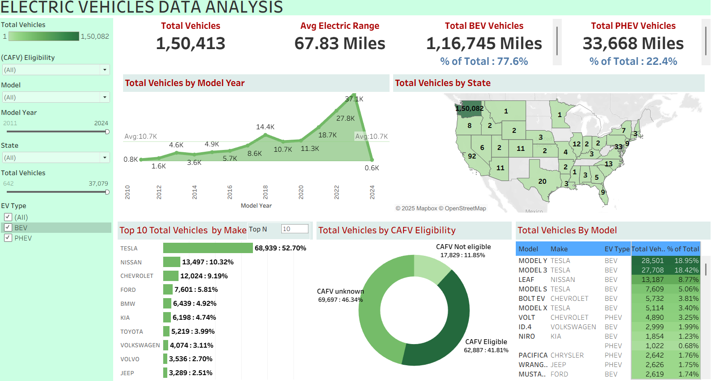

⚡ Electric Vehicles Data Analysis
🎯 Project Objective

The goal of this project is to analyze the adoption and distribution of Electric Vehicles (EVs) across the United States.
By leveraging Tableau dashboards, the project provides insights into:

📈 EV growth trends

🚗 Manufacturer dominance
🔎 Model-level performance
🗺️ Geographic distribution
💡 Incentive eligibility (CAFV)

This analysis helps policy makers, automotive companies, and researchers understand:
👉 EV market penetration, customer preferences, and areas where infrastructure or incentives could accelerate adoption.

📌 Introduction

This project develops a Tableau dashboard to explore EV population data.
It integrates KPIs, filters, and interactive charts to provide a 360° view of the EV ecosystem, including:

✅ Year-over-year adoption trends
✅ Distribution by state, make, and model
✅ BEV vs. PHEV share
✅ Incentive eligibility breakdown
✅ Electric range analysis

📊 Dashboard Overview
🔑 KPI Overview

🚘 Total Vehicles: 1,50,413 registered EVs
⚡ Average Electric Range: 67.83 miles
🔋 Total BEV Vehicles: 1,16,745 (77.6%)
🔌 Total PHEV Vehicles: 33,668 (22.4%)
📍 Chart Type: BANs (Big Ass Numbers)

📅 Total Vehicles by Model Year

Growth in EV registrations since 2010

Peak adoption: 2022 (37.1K vehicles)

Shows clear adoption curve 📈

📍 Chart Type: Area Chart with Avg. Line

🗺️ Total Vehicles by State
California 🏆 1,50,082 vehicles (leading state)
Other strong states: Washington, Florida, Texas

Highlights adoption hotspots across the US
📍 Chart Type: Filled Map (Heatmap)
🏭 Top 10 Vehicles by Make

Tesla dominates with 52.7% share (68,939) ⚡
Other players:
Nissan (10.32%)
Chevrolet (9.19%)
Ford (5.81%)
BMW (4.92%)

📍 Chart Type: Horizontal Bar Chart
🏷️ Total Vehicles by CAFV Eligibility
✅ CAFV Eligible: 62,887 (41.81%)
❌ CAFV Not Eligible: 17,829 (11.85%)
❓ CAFV Unknown: 69,697 (46.34%)

📍 Chart Type: Donut Char
🚙 Top Vehicles by Model
🚘 Tesla Model Y → 28,501 (18.95%)
🚘 Tesla Model 3 → 27,708 (18.42%)
🚘 Nissan Leaf → 13,187 (8.77%)

Other popular: Model S, Chevrolet Bolt EV, Model X, Volkswagen ID.4

📍 Chart Type: Table with Supporting Metrics
🎨 Design & Interactivity
🎚️ Filters: Year, State, Model, Make, EV Type (BEV/PHEV), CAFV Eligibility
🔄 Interactive Charts: Selecting a state/make/model updates other visuals
⚡ Dynamic KPIs: Update instantly with filters

📂 Dataset
The dataset includes EV registration records with:
🚗 Vehicle Info: Make, Model, Year, EV Type (BEV/PHEV)
⚡ Performance Data: Electric Range, MSRP (if available)
🌍 Location Data: State, City, ZIP Code
💡 Policy Data: CAFV (Clean Alternative Fuel Vehicle) Eligibility

⚙️ Parameters & Calculated Fields
🔧 Parameter
Select Year → View EV stats for chosen year
📐 Calculated Fields
Total BEV % = BEV ÷ Total Vehicles
Total PHEV % = PHEV ÷ Total Vehicles
Average Range = AVG(Electric Range)
CAFV % = Eligible ÷ Total Vehicles
Market Share = Vehicles per Make/Model ÷ Total Vehicles

💡 Key Insights
🚀 Tesla dominates → Over 50% share of the EV market
🔋 Average EV range = 67.83 miles, reflecting mix of old & new models
⚡ BEVs (77.6%) > PHEVs (22.4%) → clear preference for full electrics
🌍 California leads EV adoption (over 1.5 lakh vehicles)
❓ CAFV status unknown for 46% vehicles → highlights data/reporting gap

📸 Dashboard Preview

